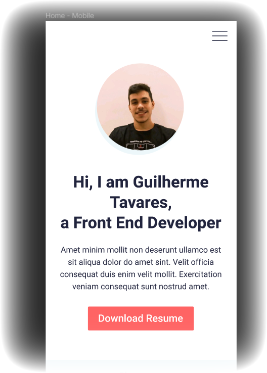

  

Este projeto é uma página web de portfólio pessoal. Foi desenvolvido ao longo da maratona ["Clonando a Netflix com HTML, CSS e GitHub"](https://www.maratonas.academy/maratona-netflix) da [Maratonas Academy](https://www.maratonas.academy/). 

[Clique aqui para conferir o repositório principal da Maratona 🏁](https://github.com/guilhermeomt/clonando-a-netflix)